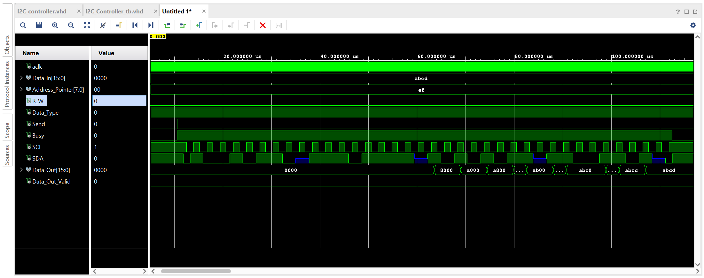
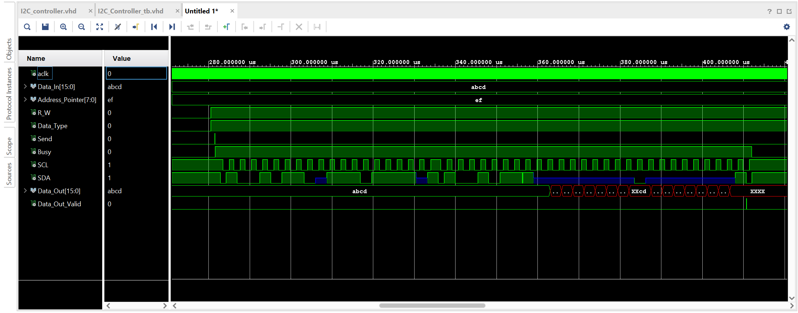
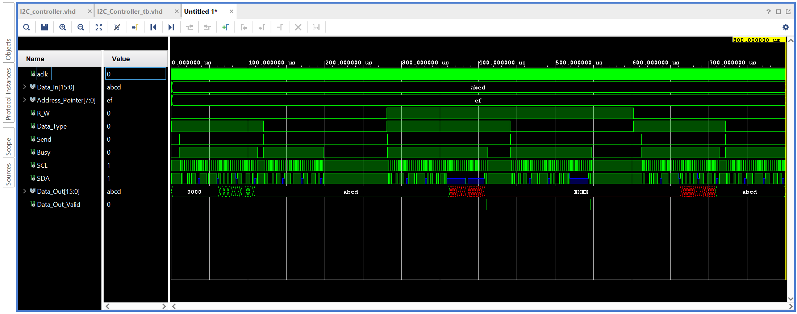

# I2C Controller (VHDL) — Simple Master (Write/Read)

A lightweight I2C master controller written in VHDL, including a self-checking style testbench and simulation waveforms.

## Features
- Generates full I2C transactions:
  - START
  - 7-bit slave address + R/W bit
  - Address pointer (register index)
  - Optional data bytes (8-bit or 16-bit)
  - ACK phases
  - STOP
- Supports **Write** and **Read** transactions (via `R_W`)
- `Busy` flag during active transfer
- `Data_Out_Valid` asserted when read data is ready
- Uses Xilinx `IOBUF` (UNISIM) for SDA bidirectional behavior

## Interface
### Inputs
- `Clock` : system clock
- `Send` : rising edge starts a new I2C transaction (when not busy)
- `R_W` : `0 = write`, `1 = read`
- `Data_Type` : `1 = 16-bit (2 bytes)`, `0 = 8-bit (1 byte)`  
- `Address_Pointer[7:0]` : target register pointer in the slave
- `Data_In[15:0]` : data to be written (used when `R_W=0`)

### Outputs
- `Busy` : high while transaction is in progress
- `SCL` : I2C clock output
- `Data_Out[15:0]` : read data (valid when `Data_Out_Valid=1`)
- `Data_Out_Valid` : pulses high when read data is ready

### Inout
- `SDA` : I2C data line (tri-stated via `IOBUF`)

## Slave Address
The slave address is currently hard-coded in the RTL:
- `Serial_Bus_Address = "01001011"` (0x4B)

If you want it configurable, you can convert it to a generic.

## Timing / Clocking Notes
Timing constants are currently hard-coded (divider/counters).
If your `Clock` frequency changes, you should scale the divider thresholds to meet the I2C spec you want (e.g., Standard-mode 100 kHz).

## Simulation
This repo includes a testbench:
- `tb/I2C_Controller_tb.vhd`

Waveform screenshots from simulation are included in:
- `docs/images/`

### Write transaction waveform

### Read transaction waveform

### Testbench overview

## Notes
- Because the RTL uses **UNISIM IOBUF**, simulation is easiest with **Vivado XSIM**.
- If you want to run with another simulator (ModelSim/Questa), you may need:
  - UNISIM library mapping, or
  - replace `IOBUF` with a simple resolved `std_logic` tri-state model in simulation.

## License
Choose a license (MIT recommended) if you want others to reuse it.
